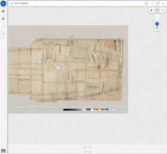

# mirador-rotation


`mirador-rotation` is a [Mirador 3](https://github.com/projectmirador/mirador) plugin that enables the rotation of images at any angle.



## 🌐 Website

[Visit the demo page](https://nakamura196.github.io/mirador-rotation-plugin/) to try it out.

## 📖 Configuration
Several configuration options are available on windows that use mirador-rotation.


Configuration | type | default | description
--- | --- | --- | ---
`rotationEnabled` | boolean | false | Enable the plugin to be shown

Example configuration:

```javascript
const config = {
  id: 'demo',
  windows: [{
    rotationEnabled: true,
    manifestId: 'https://dl.ndl.go.jp/api/iiif/1286201/manifest.json',
  }]
};
```
## 📖 Installing `mirador-rotation`

`mirador-rotation` requires an instance of Mirador 3. See the [Mirador wiki](https://github.com/ProjectMirador/mirador/wiki) for examples of embedding Mirador within an application. See the [live demo's index.js](https://github.com/nakamura196/mirador-rotation-plugin/blob/main/demo/src/index.js) for an example of importing the `mirador-rotation` plugin and configuring the adapter.

## 📣 Contribute
Mirador's development, design, and maintenance is driven by community needs and ongoing feedback and discussion. Join us at our regularly scheduled community calls, on [IIIF slack #mirador](http://bit.ly/iiif-slack), or the [mirador-tech](https://groups.google.com/forum/#!forum/mirador-tech) and [iiif-discuss](https://groups.google.com/forum/#!forum/iiif-discuss) mailing lists. To suggest features, report bugs, and clarify usage, please submit a GitHub issue.

## 🏅 Sponsors

[Become a sponsor](https://opencollective.com/mirador-rotation-plugin#sponsor)
